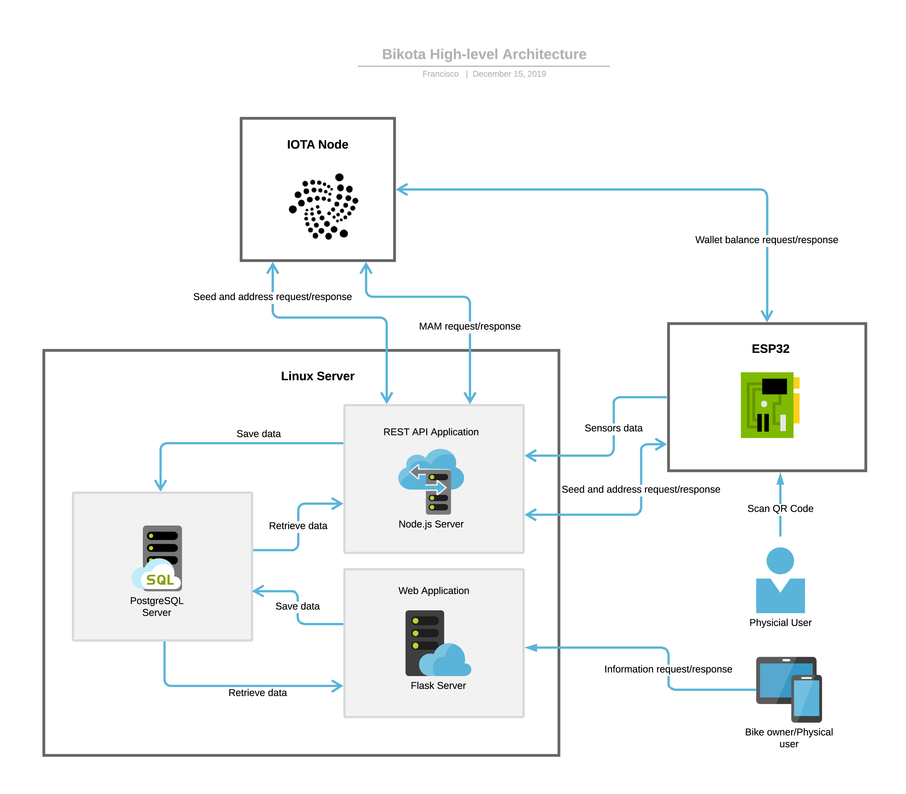
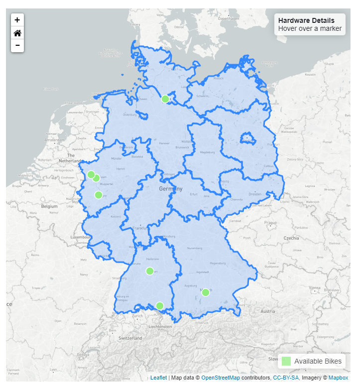

# Hochschule Rhein-Waal Applied Research Project WS19/20
## Project: Bikota - Distributed ledger-based bike renting system
##### Supervised by Prof. Timo Kahl
##### Group members: Andreas Markwart, Francisco-Alberto Susana-Canela, Thi Yen Thu Nguyen, Sarah-Maria Rostalski, Nader Kaake

### Problem Statement & Market Research 

Bike renting services are re-gaining popularity in many big cities around the world for short distances. Multiple renting services now allow users to conveniently locate vehicles with apps on their smartphone, initiate the renting and returning of a vehicle from and to anywhere unlike with the traditional renting stations.. 
However, current popular bike renting apps such as Nextbike[^1], Lyft[^2] or Uber JUMP[^3] require users to register and provide their private payment details. 

This project thus proposes an innovative bike renting service concept based on pseudo-anonymous, registration-free payment using Distributed Ledger Technology, namely IOTA[^4]. IOTA is a permissionless, immutable, scalable ledger system that allows for feeless data transaction with or without monetary values. Hence, all data related to any renting session can be anonymously collected, analyzed and utilized for future improvements of the system.

### Methodology 
The architecture of the system (see Fig. 1) can be divided into three main elements, which are: the server that manages our service; the hardware that connects the bike to our platform; and the IOTA Node that processes the payments. Every element communicates with each other through HTTP protocol to process the request from the users and bike administrators. The server consists of three sub-elements or sub-servers which handle a particular task of the renting process such as API calls, data storage and the web platforms.

*Fig. 1: System architecture - BIKOTA Renting System*

### Implementation 
#### Hardware and Firmware
The hardware is based on an ESP32 microcontroller using an E-ink display for user interaction. A SIM800 module provides 2G mobile internet access. The firmware on the ESP32 is developed in the MicroPython programming language. Environmental data like temperature, relative humidity, atmospheric pressure, particulate matter (PM10, PM2.5) and CO2 are measured by multiple sensors. A GPS module provides location data, while an accelerometer is used for automated hardware wake up and vandalism detection.

#### Software 
The software frameworks for the BIKOTA bike renting system are separated into backend and frontend modules. The backend is based on a NodeJS server which implements a RESTful API application for receiving HTTP requests from the hardware modules and sending back responses correspondingly. The data received by the API is saved in a PostgreSQL database and represented visually using the frontend. 

The frontend again consists of two separate user interfaces: a landing page for the common user and a dashboard panel for the admin of the renting system. The web servers are implemented in Python using a Flask framework for web routing and HTTPS request handling.

### Results & Discussion
#### Hardware
The hardware module (see Fig. 2) is able to collect and publish geo-referenced data about its environment, which are sent via 2G to the API application at the backend. Each renting session is handled by the device itself, as the device is checking, if there is a positive balance for an IOTA address and displays the corresponding renting time on the E-ink display. In addition, due to the modular design, it is possible to use the device only for renting and tracking; the environmental sensors are optional.

*Fig. 2: BIKOTA hardware prototype*

#### Software
##### REST API
The REST API accepts the following types of requests from the hardware modules: asking for a new session address, sending sensor data, updating the hardware status. The API returns meaningful HTTP status codes to all requests to indicate whether the requests are successful or erroneous. The complete description of the REST API can be found [here](documentation/REST_API_Server.md).

##### Landing page
The [landing page](http://bikota.xyz) is responsive and can be accessed via computer or mobile phone. It gives the user the opportunity to locate available bikes nearby (see Fig. 3) and gives information about the renting process. After a renting session the user can also view the sensor data, which has been collected during the session, by entering the session address into the interface. The data of the environmental sensors will be displayed as charts and GPS data will be projected to a map.

*Fig. 3: Bike finder section of BIKOTA landing page*

##### Admin Panel
The [admin panel](http://admin.bikota.xyz) allows the admin to have an overview of all hardware modules in the system, including their locations, their status and their usage. The admin can also perform CRUD operations to the PostgreSQL database to create, read, update and delete hardware modules (see Fig. 4). Additionally, any sensor data collected by the hardware modules can also be visualized as graphs for environmental data monitoring. The complete description and usage manual of the admin panel can be found [here](documentation/Admin_Panel_Manual.md).

*Fig. 4: Hardware manager section of BIKOTA admin panel*

### Outlook
This project proposes a proof-of-concept for a bike renting system based on the IOTA ledger. The geo-referenced data as well as sensor data collected from renting sessions are stored and visualized but can be further analyzed for environmental monitoring purposes. For future work, the data can be sent to the IOTA Tangle using Masked Authenticated Messaging protocol to allow customizable distribution channels depending on the use cases, as well as data trading on the IOTA Data Marketplace[^5]. 
Improvements can also be made to the hardware to automatically make a call or send an SMS once a collision or vandalism is detected to notify the bike owners immediately such that faster actions can be taken.

### References
[^1]: Nextbike GmbH (n.d.) Renting a bike is that easy!, Available from https://www.nextbike.de/en/information/ [Accessed 13.01.2020]
[^2]: Lyft Inc. (n.d) Bike shares near you, Available from https://www.lyft.com/bikes [Accessed 13.01.2020]
[^3]: JUMP von Uber (n.d.) JUMP - E-Bike-Verleih auf Abruf, Available from https://www.jump.com/de/de/  [Accessed 13.01.2020]
[^4]: IOTA Foundation (n.d.) What is IOTA?, Available from https://www.iota.org/get-started/what-is-iota [Accessed 13.01.2020]
[^5]: IOTA Foundation (n.d.) The IOTA Data Marketplace, Available from https://data.iota.org/ [Accessed 13.01.2020]