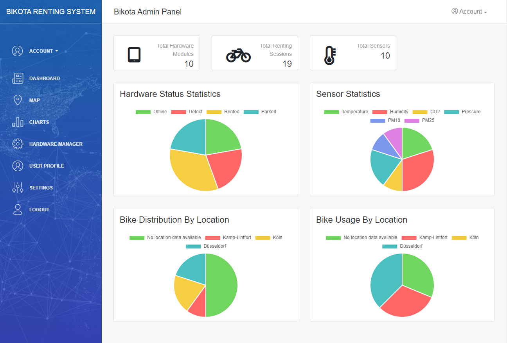
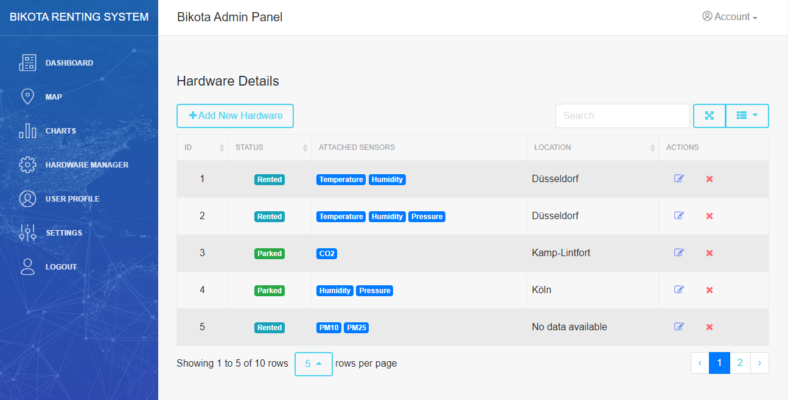
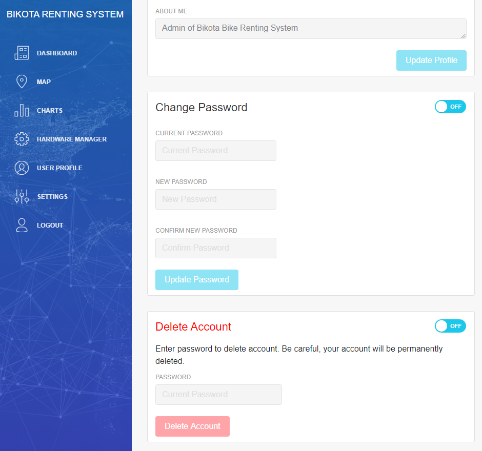

### Uasage Manual - Admin Dashboard Panel for Bikota Renting System

Version: v0.1 (26.11.2019)
Author: Thu Nguyen

#### Description
The Admin Dashboard Panel is a web platform which provides administration tools for the Bikota Renting Service including managing the mobile renting hardwares, viewing bike distribution on a map, viewing real-time renting statistics, sensor data and managing user preferences.

Available currently at https://web.dev.iota.pw

#### Pages
This section describes the various pages available on the Admin Dashboard Panel and the operations that the system admin can perform on each page.
##### Dashboard
- On this page the system admin can view system statistics including:
    - Total number of hardware modules
    - Total number of renting sessions
    - Total number of sensors mounted on hardware modules
    - Bike status statistics pie chart
    - Sensor statistics pie chart
    - Distribution of bike and bike usage by location stacked bar chart

Preview: 

##### Charts
- On this page the system admin can view collected sensor data as line charts
- The admin can filter sensor data visualization using the input field/ date time picker and dropdown menus, by following parameters:
    - `Hardware ID`, the unique ID of a hardware module on the bike
    - `Session address`, the unique address of a renting session, which is a 81-character IOTA address that was used to receive payment for that specific renting session
    - `Sensor type`, the type of sensor(s) that is/are attached to a hardware module on the bike
    - and `Time range`, the date time interval within which the admin wishes to view the sensor data 
- When a single hardware ID is selected, the corresponding sensors and session addresses related to that selected hardware will be updated in the <button style="color: #1DC7EA">Sensors type <i class="fa fa-chevron-down"></i></button> and <button style="color: #1DC7EA">Session address <i class="fa fa-chevron-down"></i></button> dropdown menus.
- When a single hardware ID and a session address is selected, the `Time range` date time picker will be disabled as each session has its own associated time interval.
- When a single hardware ID is selected and a time interval is provided/ picked, the <button style="color: #1DC7EA">Session address <i class="fa fa-chevron-down"></i></button> dropdown menu will be disabled.
- When a single hardware ID is selected but no session address or time interval is provided, a default time interval of the last hour will be used for fetching data.
- When multiple hardware IDs are selected, the <button style="color: #1DC7EA">Session address <i class="fa fa-chevron-down"></i></button> dropdown menu will be disabled as no 2 hardware modules share the same session address. 
- The admin can clear the input fields and selections using the <button><i class="fa fa-remove" style="color: red"></i></button> (Clear) icon next to each input field
- The admin has to click on the <button style="color: #1DC7EA">Update Charts</button> button to apply the selected filters. A warning message will pop up if the admin clicks this button while inputs are missing or when no data is found for selected fiters.
- Sensor data corresponding to the selected filters will be displayed as line chart(s) with proper title, legend and labels. Each chart shows the data for only a single sensor type but for one or more hardwares or session addresses.

Preview: 

#### Hardware Manager
- On this page the system admin can view a table which shows all details of every hardware module registered in the system. These includes:
    - `ID`, which is the unique ID of the hardware module
    - `Status`, which is the latest status of the hardware. The status property can only be 1 out of 4 values: 
        - `parked`, meaning the bike carrying this hardware is in parking state and thus is available for rent
        - `rented`, meaning the bike carrying this hardware is in already in a renting session
        - `defect`, meaning this hardware module is reported defective and thus is not in operation
        - `offline`, meaning this hardware module is functional but not in operation
    - `Attached sensors`, which list all sensor types attached to this hardware module
    - `Location`, which is the latest city/ state/ region where this hardware module can be found
- The admin can additionally perform following actions for the table:
    - search within the table using the `Search` input field
    - toggle fullscreen mode for the table using the <i class="fa fa-arrows-alt" style="color: #1DC7EA"></i> toggle button
    - select columns to show or hide in the table using the <button style="color: #1DC7EA"><i class="fa fa-th-list"></i> <i class="fa fa-chevron-down"></i></button> dropdown menu
    - navigate between pages
    - select the number of data rows to display per page using the <button style="color: #1DC7EA"> 5 <i class="fa fa-chevron-up"></i></button> dropup menu
- The admin can manage each hardware modules in the system using the `Actions` buttons in the corresponding row of the table including:
    - Edit details of the hardware using the <button><i class="fa fa-edit" style="color: blue"></i></button> (Edit) button. A pop-up window will appear for user to make changes to the hardware.
    - Remove the hardware completely from the system using the <button><i class="fa fa-remove" style="color: red"></i></button> (Clear) button. A pop-up window will appear for user to confirm this irreversible action.
- The admin can register new a hardware into the system using the <button style="color: #1DC7EA">+ Add New Hardware</button> button. A pop-up window will appear for user to enter details of the new hardware. 
- A warning message will pop up in one of the following cases:
    - The admin tries to register a new hardware which has the same `hardware ID` as an existing one.
    - No `hardware ID` is given while editing existing hardware or  adding new hardware
    - The system is unable to edit/ create/ remove the selected hardware
- A success message will pop up to notify if the selected hardware has been sucessfully edited in/ added to/ removed from the system.

Preview: 

#### User Profile
- On this page the system admin can activate any of the 3 following sections to make changes to their account data:
    - `Edit profile` section, where account information can be updated including: Company, Username, Email address, First name, Last name, Address, City, Country, Postal code, Biography. A success message will pop up to notify if the profile is successfully updated in the system.
    - `Change password` section, where the admin can change the account's password by typing in the current and the new passwords. A warning message will pop up if the current password(s) is/are incorrect or do not match.
    - `Delete account` section, where the account can be deleted permanently upon providing the correct password. A success message will pop up to notify if the account is successfully removed from the system.

Preview: 

-------
Based on [Flask Dashboard Light](https://appseed.us/admin-dashboards/flask-dashboard-light-bootstrap) provided by **AppSeed**
