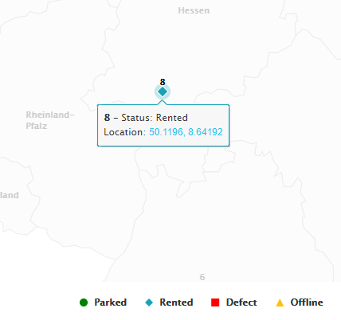
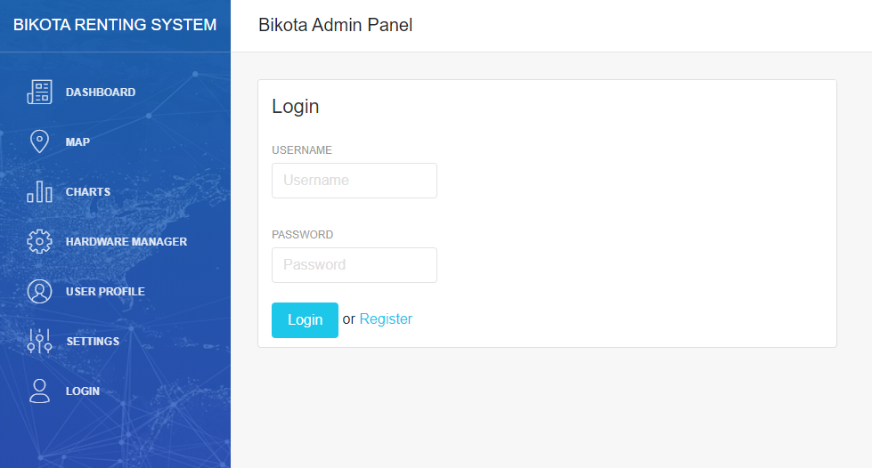
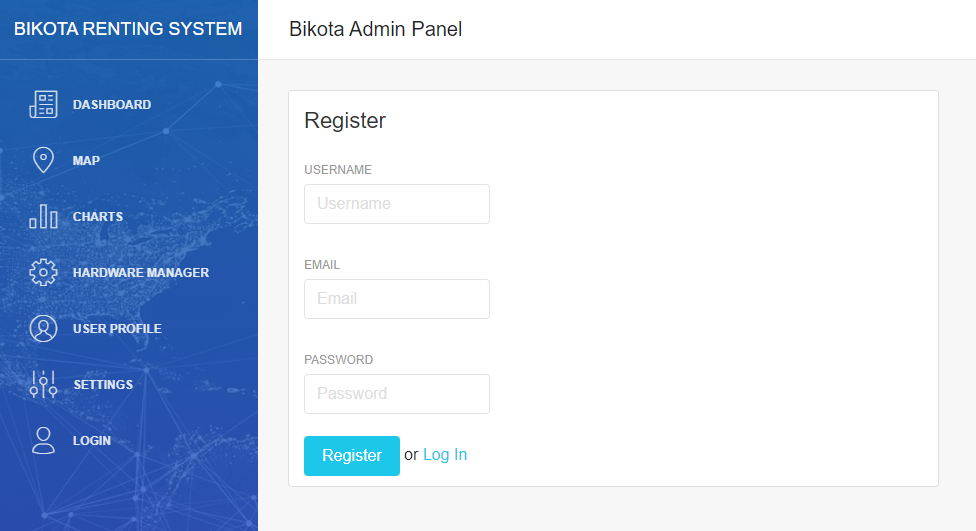

### Admin Dashboard Panel for Bikota Renting System Status Report

Version: v0.1 (01.12.2019)

Author: Thu Nguyen

#### 1. Description
The Admin Dashboard Panel is a web platform which provides administration tools for the Bikota Renting Service including managing the mobile renting hardwares, viewing bike distribution on a map, viewing real-time renting statistics, sensor data and managing user preferences.

#### 2. Pages
This section describes the various pages available on the Admin Dashboard Panel and the operations that the system admin can perform on each page.

##### 2.1. Dashboard
- On this page the system admin can view system statistics including:
    - Total number of hardware modules
    - Total number of renting sessions
    - Total number of sensors mounted on hardware modules
    - Bike status statistics pie chart
    - Sensor statistics pie chart
    - Distribution of bike and bike usage by location bar chart

Preview: 

**Note: all statistics are dummy data** 

##### 2.2. Map
- On this page the system admin can view the locations of all hardware modules in the system on a map of Germany. Each marker on the map represents one module.
- By hovering over the marker, the admin can view the status and detailed location (Longitude, Lattitude) of the specific hardware. By clicking on the hyperlinked location, the admin will be directed to a Google Maps link where the hardware is located.
- The markers are colored differently depending on the hardware status:
    - Green for `parked`
    - Blue for `rented`
    - Yellow for `offline`
    - Red for `defect`

Preview: 

##### 2.3. Login/ Register Account
- On this page the system admin can log in with an existing account using a username and password or register a new account using an email, username and password. 
- The username has to contain a minimum of 4 characters and a maximum of 20 characters. 
- The password has to contain a minimum of 6 characters and a maximum of 50 characters. 
- The email has to contain a minimum of 6 characters and a maximum of 50 characters. 

Preview: 

### Admin Dashboard Components
- [ ] User authentication
    - [X] Login 
    - [X] Registration
    - [X] Logout
    - [ ] Form input validation
- [ ] User profile management
    - [ ] Show user profile
    - [ ] Update profile
    - [ ] Update password 
    - [ ] Delete account
- [X] Main Dashboard
    - [X] System Summarized Statistics: Total number of hardwares, total number of sessions, total number of locations, total number of sensors
    - [X] System Statistics Visualizations (pie charts/ bar charts, etc.)
- [ ] Bike visualization (Main dashboard)
    - [X] Visualize all bikes as markers on a map with details including
        - Hardware ID
        - Current status
        - Current location 
    - [ ] Group markers as bubbles by locations
    - [ ] Filter map by 
        - [ ] Status
        - [ ] Location & radius
- [ ] Hardware management
    - [ ] Create new hardware with required details
        - Hardware ID
        - Attached sensor(s)
        - Address
        - Status
        - Place/ City of location
    - [ ] Update hardware details
    - [ ] Delete hardware with confirmation dialog
- [ ] Visualize sensor data of hardware(s) as charts, filter by
    - [ ] Hardware ID
    - [ ] Sensor type
    - [ ] Session address
    - [ ] Time range
- [ ] Visualize aggregated instead of raw sensor data when the queried time period returns too many data points
- [ ] Constant refresh rate of 5 seconds